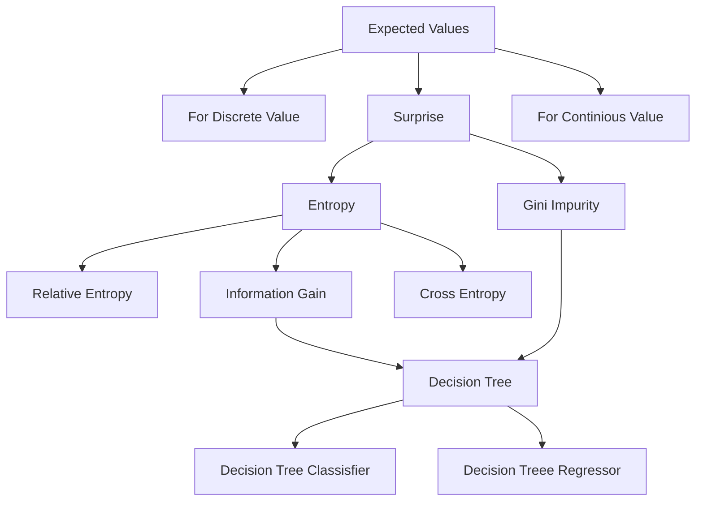

```mermaid
   
   graph TD;

   id1-->id1.1[For Discrete Value];
   id1[Expected Values] --> id2[ Surprise];
   id1-->id1.2[For Continious Value];
   
   id2 --> id3[Entropy];
   id3 --> id3.1[Relative Entropy];
   id3 --> id3.2[Information Gain];
   id3 --> id3.3[Cross Entropy];
   
   id2 --> id4[Gini Impurity];
   
   id3.2 --> id5[Decision Tree];
   id4  ---> id5;
   
   id5 --> id5.1[Decision Tree Classisfier]
   id5 --> id5.2[Decision Treee Regressor]
   
    


```
### Hello World